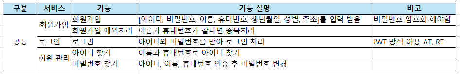

# 쇼핑몰 프로젝트

## 개요
🕐 프로젝트 기간: 2024-10-14 ~ 진행중  
🪄 프로젝트 동기: 팀프로젝트를 열심히 찾았는데 왕따라 같이 해주는 사람이 없어서...   
🚕 퇴근 후 짬짬히 달려 가면서 요구사항 정의서나 ERD 등이 변경될 예정~

## 요구사항 정의서
- 공통
  - [ ] 회원가입
      - [ ] 비밀번호 암호화
      - [ ] 프로필 사진 구현
      - [ ] 일반 사용자, 기업 사용자, 관리자로 권한 구분
  - [ ] 로그인
      - [ ] Spring Security / JWT 방식 구현
      - [ ] Redis 적용해서 RefreshToken 구현
      - [ ] 소셜 로그인 적용 (구글, 카카오 등...) [기업, 관리자 제외]
  - [ ] 회원 관리
    - [ ] 아이디 찾기
    - [ ] 비밀번호 찾기
    - [ ] 정보 수정
- 회원
  - [ ] 게시판
    - [ ] 게시글 목록 조회
    - [ ] 게시글 좋아요 기능 구현
  - [ ] 상품
    - [ ] 찜 기능 구현
    - [ ] 상품 목록 조회
    - [ ] 상품 주문 / 결제 기능 구현
  - [ ] 장바구니
    - [ ] 장바구니 담기
    - [ ] 장바구니 삭제
- 기업
  - [ ] 게시판
    - [ ] 게시글 목록 조회
    - [ ] 게시글 좋아요 기능 구현
  - [ ] 상품
    - [ ] 상품 등록, 수정, 삭제 구현
    - [ ] 판매 정보 구현
- 관리자
  - [ ] 게시판
    - [ ] 게시글 등록, 수정, 삭제 구현
    - [ ] 게시글 이미지 추가
    - [ ] 댓글 기능 구현
  - [ ] 상품 관리
    - [ ] 상품 수정, 삭제 구현
  - [ ] 회원 관리
    - [ ] 회원 삭제 및 제재 구현

## ERD

https://www.erdcloud.com/d/NhQeqSxtmF3Yz5NFQ   

수정될 가능성 농후...

Github 이메일 변경 후 테스트