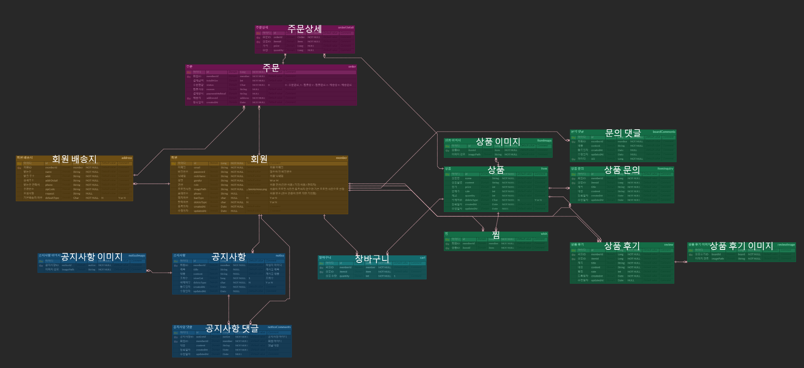

# 쇼핑몰 프로젝트

## 개요
🕐 프로젝트 기간: 2024-10-25 ~ 진행중  
🪄 프로젝트 동기: 제대로 된 서비스를 직접 만들어 보고 싶어서  
🚕 퇴근 후 짬짬히 달려 가면서 요구사항 정의서나 ERD 등이 변경될 예정~   
📖 여기에 자세한 내용들을 기재할 예정 https://magicmk.tistory.com/category/Java/%EC%87%BC%ED%95%91%EB%AA%B0

## 요구사항 정의서
- 공통
    - [x] WAS 배포 - AWS
    - [x] DB 배포 - AWS
    - [x] Redis 배포 - AWS
    - [x] EC2 docker-compose 적용
    - [x] GitHub Actions CI/CD 적용
    - [x] 회원가입
      - [x] 비밀번호 암호화
      - [x] 프로필 사진 구현
      - [x] 일반 사용자, 기업 사용자, 관리자로 권한 구분
    - [x] 로그인
      - [x] Spring Security / JWT 방식 구현
      - [x] Redis 적용해서 RefreshToken 구현
      - [x] 소셜 로그인 적용 (구글, 카카오 등...) [기업, 관리자 제외]
    - [ ] 회원 관리
      - [ ] 이메일 찾기 (...뭐를 기준으로 이메일을 찾지?..)
      - [x] 이메일 인증을 통한 비밀번호 변경
      - [x] 공지사항 목록 조회
- 회원
  - [ ] 회원 정보 수정
  - [x] 배송지 등록, 수정, 삭제 구현
  - [x] 공지사항
    - [x] 공지사항 댓글 작성
  - [ ] 상품
    - [x] 찜 기능 구현
    - [x] 상품 목록 조회
    - [ ] 상품 주문 / 결제 기능 구현
    - [x] 상품 문의 기능 구현
    - [x] 상품 후기 기능 구현
  - [ ] 장바구니
    - [ ] 장바구니 조회
    - [x] 장바구니 담기
    - [x] 장바구니 삭제
- 기업
  - [x] 공지사항
    - [x] 공지사항 댓글 작성
  - [x] 상품
    - [x] 상품 등록, 수정, 삭제 구현
    - [x] 상품 문의 답변 작성
  - [ ] 판매 정보 구현
- 관리자
  - [x] 공지사항
    - [x] 공지사항 등록, 수정, 삭제 구현
    - [x] 공지사항 댓글 작성
  - [ ] 상품 관리
    - [ ] 상품 수정, 삭제 구현
  - [x] 회원 관리
    - [x] 회원 삭제 및 제재 구현

## ERD

https://www.erdcloud.com/d/NhQeqSxtmF3Yz5NFQ   

수정될 가능성 농후...